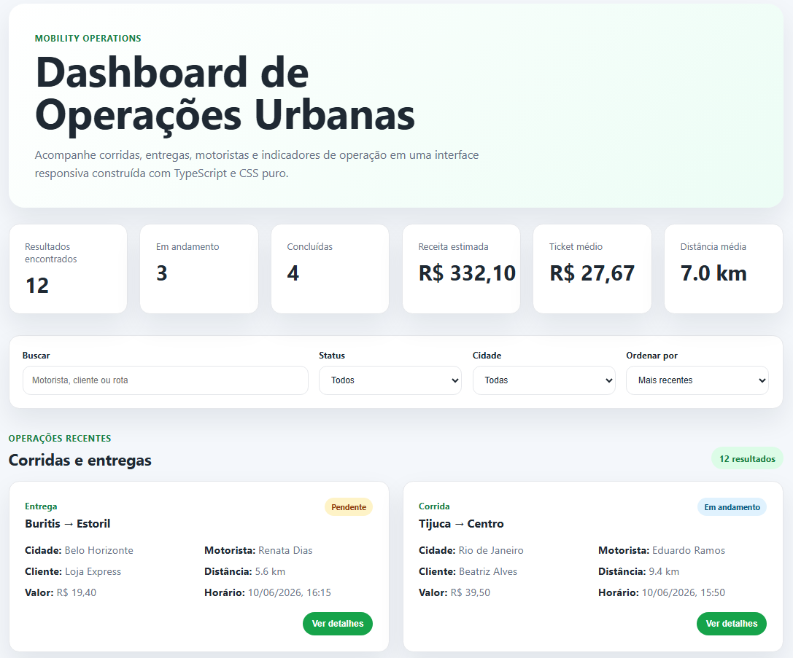

# Mobility Operations Dashboard

Este é um dashboard frontend para acompanhar operações de mobilidade urbana, como corridas e entregas.

Criei este projeto para praticar e demonstrar fundamentos importantes de desenvolvimento Frontend, incluindo TypeScript, JavaScript puro, CSS, consumo de dados com `fetch`, filtros, ordenação, responsividade, acessibilidade e testes.

A ideia foi construir uma interface parecida com algo que poderia ser usado por uma empresa de mobilidade para visualizar operações em andamento, concluídas, pendentes ou canceladas.

## Preview

Projeto publicado: https://mobility-operations-dashboard.vercel.app/



## Funcionalidades

* Dashboard com indicadores das operações
* Listagem de corridas e entregas
* Busca por motorista, cliente, origem ou destino
* Filtro por status
* Filtro por cidade
* Ordenação por data ou valor
* Painel lateral com detalhes da operação
* Fechamento do painel com botão, clique fora ou tecla `Esc`
* Estado de carregamento
* Mensagem quando nenhum resultado é encontrado
* Layout responsivo para desktop e mobile
* Consumo de dados usando uma API simulada em JSON
* Testes simples para filtros e ordenação

## Destaques técnicos

Alguns pontos que trabalhei neste projeto:

* uso de TypeScript para tipar os dados das operações;
* separação da lógica de API, tipos, utilitários, filtros e estilos;
* consumo de dados com `fetch`;
* filtros combinados por status, cidade e busca textual;
* ordenação por data e valor;
* renderização dinâmica dos cards;
* painel lateral de detalhes usando manipulação do DOM;
* melhoria de acessibilidade no painel de detalhes;
* tratamento de estados como carregamento e lista vazia;
* layout responsivo usando CSS puro;
* testes unitários simples com Vitest;
* build de produção com Vite;
* deploy na Vercel.

## Tecnologias utilizadas

* HTML
* CSS puro
* TypeScript
* JavaScript Vanilla
* Fetch API
* Vite
* Vitest
* Git e GitHub
* Vercel

## Por que fiz este projeto

Meu objetivo com este projeto foi criar algo mais próximo de uma situação real de trabalho, em vez de apenas uma tela estática.

Por isso, além da parte visual, também trabalhei com lógica de busca, filtros, ordenação, renderização dinâmica, organização de código, responsividade, acessibilidade e testes.

Também optei por usar JavaScript/TypeScript sem frameworks de interface, para reforçar a base de Frontend e demonstrar domínio dos fundamentos.

## Relação com a vaga

Este projeto foi pensado para demonstrar habilidades relacionadas a desenvolvimento Frontend em um contexto de mobilidade urbana.

Ele trabalha com pontos importantes para esse tipo de aplicação, como visualização de dados operacionais, filtros, busca, ordenação, consumo de API, responsividade, organização de código e atenção à experiência do usuário.

## Estrutura do projeto

```txt
mobility-operations-dashboard/
├── docs/
│   └── preview-dashboard.png
├── public/
│   └── api/
│       └── rides.json
├── src/
│   ├── api/
│   │   └── mobilityApi.ts
│   ├── assets/
│   ├── styles/
│   │   └── main.css
│   ├── types/
│   │   └── ride.ts
│   ├── utils/
│   │   ├── formatters.ts
│   │   ├── rideFilters.ts
│   │   └── rideFilters.test.ts
│   └── main.ts
├── index.html
├── package.json
├── tsconfig.json
└── README.md
```

## Como rodar o projeto

Clone o repositório:

```bash
git clone https://github.com/CarlosFelipePaixao/mobility-operations-dashboard.git
```

Entre na pasta do projeto:

```bash
cd mobility-operations-dashboard
```

Instale as dependências:

```bash
npm install
```

Rode o projeto localmente:

```bash
npm run dev
```

Depois acesse no navegador:

```txt
http://localhost:5173
```

## Testes

Para rodar os testes:

```bash
npm run test
```

Os testes cobrem funções simples de filtro, busca, ordenação e listagem de cidades únicas.

## Build

Para gerar a versão de produção:

```bash
npm run build
```

Para visualizar a versão de produção localmente:

```bash
npm run preview
```

## O que aprendi/reforcei com este projeto

Durante o desenvolvimento, trabalhei principalmente com:

* organização de um projeto Frontend com Vite;
* tipagem de dados com TypeScript;
* manipulação do DOM sem framework;
* consumo de dados com `fetch`;
* criação de filtros e ordenação;
* separação de lógica para facilitar testes;
* renderização dinâmica de componentes;
* responsividade com CSS puro;
* melhoria de acessibilidade em componentes interativos;
* testes unitários simples com Vitest;
* versionamento com Git;
* deploy de aplicação Frontend na Vercel.

## Melhorias implementadas

* [x] Publicar o projeto em uma plataforma de deploy
* [x] Adicionar screenshots no README
* [x] Adicionar mais dados simulados
* [x] Melhorar a acessibilidade do painel de detalhes
* [x] Criar testes simples para as funções de filtro e ordenação
